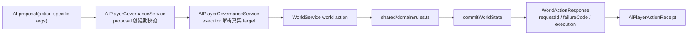

# AI 玩家后端知识图谱（2026-04-20）

## 1. 作用

- 这份文档只记录 AI 玩家 / 后端 authority 线，不记录 UI 结构。
- 目标是让后续窗口先知道“已经正式化了什么、怎么验证、哪些坑不要再踩”，避免重复摸索。
- 如果文档口径与代码实现冲突，以“全文搜索后的代码事实 + 正式入口验证”结论为准。
- 机器可读入口：`shared/contracts/aiPlayerKnowledgeGraph.ts`
  - 这份文件现在是“哪些动作已正式化、哪些 authority 明确延期”的可导入版本。
- 静态 catalog 入口：`server/src/application/ai/aiPlayerActionCatalog.ts`
  - 这份文件无 world/runtime 初始化副作用，可直接被测试和后续工具导入。
- proposal execution 入口：`server/src/application/ai/aiPlayerProposalExecution.ts`
  - 这份文件承接 action resolver + world action 执行细节；`AIPlayerGovernanceService.ts` 现在只保留 proposal/receipt/persist/governance event 包装。
- 治理核心分层入口：
  - `server/src/application/ai/aiPlayerGovernanceState.ts`
  - `server/src/application/ai/aiPlayerGovernancePersist.ts`
  - `server/src/application/ai/aiPlayerGovernanceRuntimeView.ts`
  - `server/src/application/ai/aiPlayerProposalLifecycle.ts`
  - `server/src/application/ai/aiPlayerGovernanceEvents.ts`
  - `server/src/application/ai/AIPlayerGovernanceService.ts` 现在是 facade，负责保留 routes/MCP/tests 依赖的公开 API。
- 版本控制白名单：
  - `shared/contracts/aiPlayerKnowledgeGraph.ts` 里的 `AI_PLAYER_BACKEND_VERSION_CONTROL_SCOPE` 是当前 AI 玩家后端白名单和 review 口径。
  - `server/tests/ai_player_backend_knowledge_graph.test.ts` 会校验这些路径存在，并覆盖 facade / lifecycle / persist / runtime split。
- 正式读面入口：
  - HTTP: `GET /api/ai/knowledge-graph`
  - HTTP route split:
    - `server/src/routes/aiPlayerKnowledgeGraphRoute.ts`
    - `server/src/routes/aiPlayerProposalRoutes.ts`
    - `server/src/routes/aiPlayerRuntimeRoutes.ts`
  - MCP: `get_ai_player_knowledge_graph`
  - MCP 注册模块：`server/src/mcp/registerAiPlayerTools.ts`
  - `format=obsidian` 只做 Obsidian/Markdown 镜像导出，不替代 repo 内 typed source of truth。
- 资源输送交接文档：
  - `docs/AI_PLAYER_RESOURCE_TRANSFER_AUTHORITY_HANDOFF_2026_04_21.md`
  - 该文档只记录后端 authority 阻塞与 UI 消费要求，不代表已经新增 AI 玩家白名单动作。
- 正式校验入口：
  - `npm run test:ai:knowledge-graph`
  - `npm run test:ai:knowledge-graph:http-contract`
  - `npm run test:ai:knowledge-graph:mcp`
  - `npm run test:ai:governance-guard`
  - `npm run gate:ai:preflight`

## 2. 核心权威图



### 2.1 必须持续成立的事实

- AI 玩家真正的权威写链仍是：
  `SessionManager -> WorldService -> shared/domain/rules.ts -> commitWorldState`
- `proposal.args` 必须 action-specific。
- proposal 必须在创建期校验；坏参数要在 `422` 被拦住，不能拖到执行期。
- executor 必须走 `WorldService` 权威写链，不能直接改 world。
- receipt 必须带：
  - `worldAction`
  - `failureCode`
  - `execution`
  - 能拿到时再补 `actionRequestId / worldActionPayload`

## 3. 已正式化的 AI 玩家 v1 原子动作

| AI 动作 | World authority | 核心语义 | 关键代码 |
| --- | --- | --- | --- |
| `city_upgrade` | `upgradeCity` | 升一级 owned city hall | `AIPlayerGovernanceService.ts` / `WorldService.ts` / `rules.ts` |
| `building_upgrade` | `promoteCityBuilding` | 升 owned city building | 同上 |
| `queue_fill_idle_slot` | `enqueueAffair` | 填第一个空 affairs 槽 | 同上 |
| `research_start` | `upgradeCityTech` | 开一条 city tech | 同上 |
| `troop_train` | `deployReserveHero` | 把 reserve hero 上图，不是独立征兵系统 | 同上 |
| `recruit_commander` | `recruitProspectHero` | 当前 baseline 保留 success + structured failure 双样本 | 同上 |
| `recruit_pool_select` | `setRecruitSelectedPool` | 切招募池 authority，可与 `recruit_commander` 串成完整链 | 同上 |
| `world_scout` | `queuePlanExecution` | 为 unit 排一条 `recon` order | 同上 |
| `march_move` | `moveUnit` | 相邻 tile 行军 | 同上 |
| `garrison_set` | `queueTacticalOverride` | 套 `garrison` 模板 | 同上 |
| `troop_facility_upgrade` | `promoteTroopFacilityBuilding` | 升级 troop panel 设施建筑，默认走首个 authority 路径 | 同上 |
| `general_focus_set` | `setGeneralActiveHero` | 写权威 `activeHeroId`，不是 UI 本地焦点 | 同上 |
| `formation_assign` | `setGeneralTactic` | 写权威战法，并同步 directive preview | 同上 |
| `threat_escape` | `queueAiAgendaAction` | 走 `agenda_recover / agenda_redeploy`，不是直接 move | 同上 |
| `alliance_help` | `allianceHelp` | 对联盟战区做一次正式协助 | 同上 |
| `reward_claim` | `claimReward` | 领取 `FactionState.claimableRewards` 中的待领奖励 | 同上 |

## 4. 已补的后端 authority

### 4.1 新 authority

- `allianceHelp`
  - 状态面：`AllianceDirective / commander / feedback.allianceActions`
  - 正式验证：`npm run test:world:alliance-help-http-contract`
- `claimReward`
  - 状态面：`FactionState.claimableRewards`
  - 奖励来源：当前已接 `provincePve` 清剿后挂起奖励
  - 正式验证：`npm run test:world:reward-claim-http-contract`

### 4.2 已增强的既有 authority

- `setGeneralTacticAction`
  - 已补 `requestId / execution`
- `setGeneralActiveHeroAction`
  - 已补 `requestId / execution`
- `queueAiAgendaActionAction`
  - 已正式返回 `execution`

## 5. world-action template / replay 沉淀

- 已存在模板：
  - `upgrade_first_city_building`
  - `enqueue_first_city_affair`
  - `recruit_first_commander`
  - `deploy_first_reserve_hero`
- `runAiMainlineStabilityGate` replay 已覆盖这些模板，并带显式 recharge step，避免 baseline 预算不够导致假失败。

## 6. 关键坑位 / 不要重做

### 6.1 recruit_commander

- `recruit_commander` baseline success 样本必须放在任何 `advanceTick` 之前。
- 原因：
  `advanceTick` 会自动消耗 `prospectHeroIds`。
- 当前 baseline 在 `shared/domain/scenario.ts` 里把 `developmentPoints` 提到可首抽成功，再保留后续 failure 样本。

### 6.1.1 recruit_pool_select

- `recruit_pool_select` 当前复用的是 `setRecruitSelectedPool`。
- pool id 现在按 Godot authority intent 收口为：
  - `pool_standard`
  - `pool_season`
  - `pool_limited`
- 默认策略不是重复写当前池子，而是优先切到“与当前 authority 状态不同”的第一个 pool。

### 6.2 reward_claim

- `reward_claim` 不是直接对 PVE 结果做即时到账。
- 当前语义是：
  `provincePve` 清剿后生成 `claimableRewards` -> 玩家或 AI 再显式 `claimReward`。

### 6.3 threat_escape

- `threat_escape` 现在是 agenda 级 authority：
  - `recover -> agenda_recover`
  - `redeploy -> agenda_redeploy`
- 它不是“直接把 unit move 回城”的硬编码撤退。

### 6.4 formation_assign

- `formation_assign` 当前收口的是权威战法切换。
- 底层是 `setGeneralTactic`，不是完整编组系统。

### 6.5 general_focus_set

- `general_focus_set` 当前收口的是权威 `activeHeroId` 切换。
- 它不是 Godot 本地焦点态，也不是纯 UI 行为。

### 6.6 troop_facility_upgrade

- `troop_facility_upgrade` 当前复用的是 `promoteTroopFacilityBuilding`。
- facility/building id 直接复用 troop panel authority id：
  - `training_ground / training_ground_base`
  - `recruit_station / recruit_station_base`
  - `command_hall / command_hall_base`
  - `support_structures / supply_camp`
- `rules.ts` 当前会对 troop facility state 做 lazy init，所以 baseline 不需要先手动造设施状态。

### 6.7 AI 玩家向真人/总督输送资源

- 当前没有可直接接入的 world authority。
- 已在 `shared/contracts/aiPlayerKnowledgeGraph.ts` 登记 deferred candidate：
  `transferFactionResourcesToGovernor`。
- 不能把 `resource_item_use / resource_gather / alliance_donate` 误当成资源输送动作；它们当前都不是 executable v1，也不是“AI 资源转给真人”的结算链。
- 代码事实：
  `FactionState` 是势力级资源，`AIPlayer` 当前是部队分组；V2 `AIPlayerV2.resources` 不属于当前 AI 玩家治理正式写链。
- 必须先定义后端 authority 和目标钱包/收件箱，再谈 AI 玩家 shared contract/schema。
- UI 侧交接见：
  `docs/AI_PLAYER_RESOURCE_TRANSFER_AUTHORITY_HANDOFF_2026_04_21.md`。

## 7. 正式验证入口

### 7.1 常规正式链

- `npm run build`
- `npm run test:ai:knowledge-graph`
- `npm run test:ai:knowledge-graph:http-contract`
- `npm run test:ai:knowledge-graph:mcp`
- `npm run test:ai:player-http-contract`
- `npm run gate:ai:preflight`
- `npm run test:world:alliance-help-http-contract`
- `npm run test:world:reward-claim-http-contract`
- `npm run gate:ai:runtime-capacity`

说明：

- `gate:ai:preflight` 现在是 AI 玩家治理线的前置守门入口。
- 它会先跑 `build + knowledge-graph(static/http/mcp) + player-http-contract`，再决定是否进入更重的 trio/mainline/nightly 门禁。
- `gate:ai:runtime-capacity` 现在也直接包含 `test:ai:governance-guard`，不再只跑 `player-http-contract` 单项。

### 7.2 mainline 正式跑法（隔离环境）

```powershell
$ts=[DateTimeOffset]::UtcNow.ToUnixTimeMilliseconds()
$env:WORLD_PERSIST_ROOT="C:\Users\26739\Desktop\8989\tmp\gate_mainline_world_$ts"
$env:SESSION_STATE_PERSIST_PATH="C:\Users\26739\Desktop\8989\tmp\gate_mainline_session_$ts.json"
$env:NODE_OPTIONS='--max-old-space-size=4096'
npm run gate:ai:mainline:stability
```

### 7.3 本地起后端给 Godot gate 用

```powershell
cmd /c "set GAME_CLOCK_ENABLED=1&& npx tsx server/src/app.ts"
```

## 8. 剩余可复用 authority 与阻塞

### 8.1 仍可继续接 AI 动作的既有 authority

- `setAiContextFocus`

### 8.2 当前真正阻塞点

- 不是“AI 玩家没有 backend 写链”。
- 而是“剩余 authority 还没有收口成清晰的玩家原子动作语义”。
- `setAiContextFocus` 现在已经有显式 `defer` 结论；它更像运行时上下文 authority，不天然等于玩家操作。
- 没有新的业务语义前，不要再重复尝试把 `setAiContextFocus` 包装成新 AI 玩家动作。
- `transferFactionResourcesToGovernor` 现在也是显式 `defer` 结论；它是资源输送 authority candidate，不是已经存在的 world action。
- 资源输送必须先决定真人资源落点、AI 子账户/势力账户扣款语义、审批/预算/冷却规则，再接 AI 玩家合同。
- 这条 deferred candidate 现在在机器可读图谱里带 `blockers`：
  - `target-wallet-semantics`
  - `source-account-semantics`
  - `transfer-scope`
  - `approval-and-limits`
  - `ui-consumption-contract`
- 其中最需要用户拍板的是 `target-wallet-semantics` 和 `source-account-semantics`；否则后端无法判断该扣谁、该加给谁。
- 继续推进时必须按这个顺序：
  1. 全文搜索代码事实
  2. 收口动作语义
  3. shared contract/schema
  4. governance executor
  5. 正式 HTTP 合同测试
  6. `runtime-capacity`

## 9. 后续窗口建议读取路径

1. `docs/AI_PLAYER_WINDOW_HANDOFF_2026_04_20.md`
2. 本文：`docs/AI_PLAYER_BACKEND_KNOWLEDGE_GRAPH_2026_04_20.md`
3. `shared/contracts/aiPlayer.ts`
4. `shared/schemas/aiPlayer.ts`
5. `server/src/application/ai/AIPlayerGovernanceService.ts`
6. `server/tests/ai_player_http_contract.test.ts`

## 10. 这份沉淀能解决什么

- 让新 AI 窗口先知道哪些动作已经正式化，不再重复“全文搜索 -> 误判 authority 不存在”。
- 让新 AI 窗口先知道哪些验证入口已经固定，不再重复造一次性脚本。
- 让新 AI 窗口先知道关键坑位，避免再次把 `recruit_commander` success 样本排到 `advanceTick` 之后。
