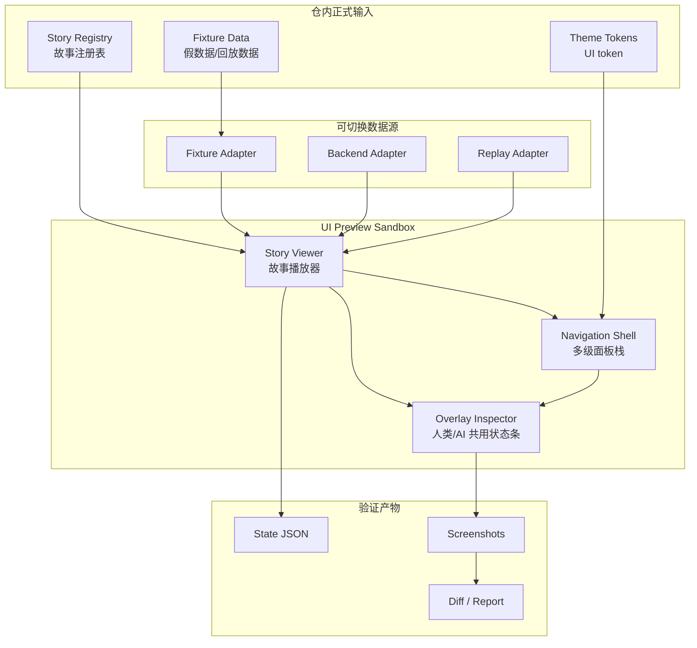

# SLG UI Preview Sandbox 架构文档（2026-04-12）

## 1. 目标

本文件定义一个可复用的 Godot UI Preview Sandbox，而不是临时 demo。

目标不是“把 UI 挪到另一个场景里看看”，而是建立一个长期稳定的 UI 研究/调试/回归入口，满足以下要求：

1. 人类可以在引擎里直接点击、切层、返回、缩放、悬停，并立刻看到结果。
2. AI 也可以基于同一份注册表、同一份假数据、同一套截图回归入口，理解当前 UI 状态。
3. 后续接入真实后端数据时，不需要重写 UI 导航结构，只替换数据适配层。
4. 任何子代理或独立窗口都只需要识别少量正式入口，就能复用同一套 sandbox 约定。

当前仓内已经有可复用基础：

- `godot-client/scenes/app/main.tscn`
- `godot-client/scenes/ui/observability_panel.tscn`
- `godot-client/scripts/ui/ui_theme_tokens.gd`
- `godot-client/scripts/ui/slg_panel_stack.gd`
- `godot-client/tools/run_slg_ui_phase1_validation.py`

本架构文档的核心决策是：**主场景继续服务真实运行链，Preview Sandbox 独立服务 UI 纠错、故事回放和截图回归**。

## 2. 为什么它比主场景纠错更快

主场景纠错慢，根因是它同时承担了太多职责：后端连接、世界加载、观测桥、地图绘制、HUD、面板导航、输入验证和截图证据。任何 UI 改动都会被这些非 UI 因素放大。

Preview Sandbox 要做的事更少：

1. 只保留 UI 结构、导航、token、假数据和截图。
2. 不依赖真实战斗逻辑，不等世界推进，不等后端长链路。
3. 让每一次点击都变成确定的 `route -> render -> snapshot`，减少“猜测改对没改对”的反复。
4. 让相同故事可以被反复打开，而不是每次从主场景状态里重新找入口。

这比主场景快的关键，不是“更轻”，而是“职责更纯”。UI 问题应该在 UI 入口里闭环，不应该在完整游戏启动链里排查。

## 3. 现状与边界

现有仓内状态说明：

1. `main.tscn` 仍是实际运行主场景，不能被 Preview Sandbox 污染。
2. `observability_panel.tscn` 已经证明可以把“状态观测”做成独立 UI 层。
3. `slg_panel_stack.gd` 已经证明可以在 Godot 内部实现可验证的多级面板栈。
4. `ui_theme_tokens.gd` 已经证明 UI 外观可以由 token 驱动，而不是写死单图路径。
5. `run_slg_ui_phase1_validation.py` 已经证明可以在本机形成可复现的截图回归链。

所以 Preview Sandbox 不是从零开始，而是把这些基础收束成一条正式的 UI 工作流。

## 4. 目标架构

### 4.1 分层

### 4.2 角色定义

1. `Story Registry` 是唯一故事入口，按 `story_id` 找到要打开的 UI 场景、初始路由、数据源和截图断言。
2. `Fixture Adapter` 提供默认假数据，保证不连后端也能完整跑 UI。
3. `Backend Adapter` 只负责把真实数据映射成同一份 sandbox 状态，不改 UI 结构。
4. `Replay Adapter` 负责把已记录的交互或回放数据重放到同一 UI。
5. `Overlay Inspector` 负责把当前 `story_id / route / layer / data_source / snapshot_hash` 展示给人类和 AI。

## 5. 人类和 AI 都能边点边看的方式

这里要解决的不是“能不能点”，而是“点完之后 AI 和人类是不是看的是同一份事实”。

### 5.1 人类视角

人类在 Godot Editor 或独立运行窗口里操作：

1. 打开 Sandbox。
2. 从故事列表选择一个 story。
3. 点 `Open L2 / Open L3 / Open L4` 之类的导航动作。
4. 通过顶部/侧边的 overlay 看见当前层级、路由和数据源。
5. 一次修改后，直接重放同一 story，看是否仍然成立。

### 5.2 AI 视角

AI 不应该靠“猜当前场景是什么”来工作。它应该只依赖三类机器可读事实：

1. `story registry`。
2. `state json`。
3. `screenshot / report`。

也就是说，AI 要知道的是：

- 当前打开的是哪个 `story_id`
- 当前路由是什么
- 当前层级是谁
- 当前数据来自 fixture 还是 backend
- 当前截图与上一次比较是否一致

这使得 AI 可以不看整个主场景，也能知道 UI 现在处于什么状态。

## 6. 故事注册表、假数据与真实数据接入

### 6.1 故事注册表

建议仓内新增一个正式注册表目录，例如：

- `godot-client/assets/ui_preview/stories/index.json`
- `godot-client/assets/ui_preview/stories/*.json`

每个 story 至少包含：

1. `story_id`
2. `title`
3. `entry_scene`
4. `viewport`
5. `initial_route`
6. `data_source`
7. `expected_layers`
8. `capture_steps`
9. `assertions`

故事注册表是 sandbox 的“单一事实来源”，不能散落在脚本参数、场景节点名字或口头约定里。

### 6.2 假数据

假数据应该版本化并可复用，建议分成三层：

1. 结构层：列表、卡片、角色、城池、按钮状态、层级树。
2. 行为层：打开、关闭、返回、禁用、 hover、高亮。
3. 视觉层：token 所需的图片、色块、边距、占位文案。

假数据的职责不是“尽量像真实后端”，而是“稳定覆盖 UI 分支”。它要能支撑：

- 空态
- 多项态
- 长文本
- 缺图回退
- 受限按钮
- 多级面板切换

### 6.3 接入真实数据

真实数据接入时，不允许 UI 结构直接依赖后端 JSON 形状。

正确方式是：

1. 后端数据先进入 `Backend Adapter`。
2. Adapter 变成 sandbox 统一状态对象。
3. UI 只读统一状态对象，不关心来源。

这样后续即使后端字段改名，UI 也只需要改适配层，不需要改故事、路由和回归用例。

## 7. 截图回归与正式入口

### 7.1 截图回归原则

截图回归不要把整个项目当成测试对象，而要把“故事”当成测试对象。

每个 story 的回归应固定：

1. 入口。
2. viewport。
3. 点击序列。
4. hover/缩放步骤。
5. 产物目录。

推荐产物目录：

- `tmp/screenshots/ui_preview/<story_id>/`

目录里至少包含：

- 基线截图
- 关键层级截图
- 悬停/缩放截图
- `state.json`
- `report.json`

### 7.2 正式入口组织

当前仓内已存在的正式入口应当复用，而不是再造一套临时脚本：

1. `npm run start`
2. `D:\Apps\Godot\Godot_v4.6.2-stable_win64_console.exe --headless --path godot-client --quit-after 1`
3. `D:\Apps\Godot\Godot_v4.6.2-stable_win64.exe --path godot-client`
4. `py -3.11 godot-client/tools/run_slg_ui_phase1_validation.py`

设计原则是：

- 运行态入口负责看 UI。
- headless 入口负责验证逻辑是否能启动。
- validation 入口负责产出截图和回归证据。

后续如果新增专用 sandbox 验证脚本，也必须沿用相同的 story registry 和截图目录约定，不能单独发明一套命名体系。

## 8. 借鉴与不采纳

### 8.1 `levinzonr/godot-ui-navigation-system`

参考链接：<https://github.com/levinzonr/godot-ui-navigation-system>

可借鉴点：

1. `push / pop` 的导航语义清晰。
2. 把 UI 视作有状态的导航栈，而不是一堆互不关联的面板。
3. 把路由关系集中为单一事实来源。

不采纳点：

1. 不引入额外的外部 addon 依赖作为仓内正式入口。
2. 不依赖 in-engine graph editor 作为正式维护方式。
3. 不把导航系统做成与仓内场景结构脱节的黑盒插件。

仓内决策：

- 采用“栈式路由 + 单一故事注册表”。
- 用本仓内 GDScript/scene 维护导航，而不是把维护权交给插件。

### 8.2 `KantaiMishima/godot-vrt`

参考链接：<https://github.com/KantaiMishima/godot-vrt>

可借鉴点：

1. 截图回归应当是独立的正式工具链。
2. 使用固定 viewport 和稳定等待策略，避免帧同步噪音。
3. 每个 scene 可以绑定自己的 story 配置，而不是全局一刀切。
4. 截图职责与 diff/baseline 管理职责分离。

不采纳点：

1. 不把整个项目递归扫一遍当作正式回归入口。
2. 不把 baseline 逻辑全部丢给外部工具，仓内必须保留 story/fixture 语义。
3. 不把回归结果只放在临时目录而没有可追踪的故事 ID。

仓内决策：

- 采用“故事驱动的截图回归”。
- 输出目录保留在 `tmp/screenshots/`，但故事定义必须在仓内可读。
- 若后续需要长期 golden baseline，再单独把 baseline promotion 做成显式流程。

## 9. 仓内落地决策

1. `main.tscn` 继续作为真实游戏运行主场景，不承担 sandbox 职责。
2. Preview Sandbox 独立承担 UI 调试、故事回放和截图回归。
3. `ui_theme_tokens.gd` 继续作为 UI 外观 token 层，sandbox 只能读 token，不得写死单图路径。
4. `slg_panel_stack.gd` 作为多级面板栈的可复用导航原型，后续 sandbox 直接复用其 push/pop 语义。
5. `run_slg_ui_phase1_validation.py` 继续作为当前正式验证链的证据出口，后续新增 sandbox 验证脚本必须兼容它的产物结构。
6. 任何 AI 窗口只要知道 `story_id` 和 registry 路径，就能在同一 sandbox 中复现同样的 UI 状态。
7. 统一截图回归入口由 `godot-client/tools/run_ui_preview_sandbox_regression.py` 和 `npm run godot:ui:preview:regress` 提供，回归结果必须输出机器可读 report，包含命令、截图、hash 对比和结论。

## 10. 验收标准

Preview Sandbox 只有在同时满足以下条件时才算正式可用：

1. 不依赖真实后端也能打开至少一个完整 story。
2. 人类能从 UI 里手动切层、返回、缩放、悬停，并看到路径反馈。
3. AI 能通过 registry + state json + screenshot 复现同一 story。
4. 真实数据切换只影响 Adapter，不影响 UI 导航和 layout 结构。
5. 截图回归有稳定正式入口，且输出路径固定。

## 11. 结论

这个 Preview Sandbox 的核心不是“多一套 demo 场景”，而是把 UI 开发从主场景里剥离出来，形成一个可复用、可观察、可回放、可回归的正式工作台。

它应该成为后续所有 UI 改动的第一观察点，而不是主场景纠错的附属品。
