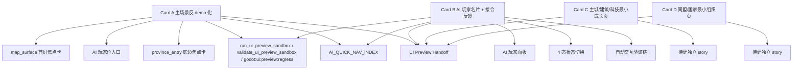

# TASK 003 - 产品前台四卡执行文档（2026-04-14）

## 0. 任务目标

这 4 张卡不是继续堆 sandbox 功能，而是把现有 `Godot + UI Preview Sandbox` 向“可玩产品前台”推进。

目标分成四块：

1. 卡 A：主场景反 demo 化
2. 卡 B：AI 玩家名片 + 接令反馈
3. 卡 C：主城/建筑/科技最小成长页
4. 卡 D：同盟/国家最小组织页

## 1. 官方入口命令（复用链）

- `py -3.11 godot-client/tools/run_ui_preview_sandbox.py`
- `py -3.11 godot-client/tools/validate_ui_preview_sandbox.py --presentation-capture --report-path tmp/screenshots/ui_preview_sandbox/preview_validation_report.json --screenshot-dir tmp/screenshots/ui_preview_sandbox`
- `npm run godot:ui:preview:regress`
- `D:\Apps\Godot\Godot_v4.6.2-stable_win64_console.exe --headless --path C:\Users\Buffoon Queer\Desktop\8989\godot-client --quit-after 1`

## 2. 固定硬约束

1. 只做 Godot 客户端前台与必要 docs，不做 React/Web 替代页面。
2. 默认沿 `UI Preview Sandbox` 主线推进，不回 `main.tscn / main.gd` 盲改。
3. 优先做 `story -> panel -> fixture -> screenshot` 闭环，不先追求后端全接通。
4. 每张卡都必须至少复用一条正式入口命令。
5. 若涉及中文文档回写，必须做 UTF-8 回读校验。

## 3. 四张卡

| Card ID | 卡名 | 目标 | 建议白名单 | 正式验证入口 |
| --- | --- | --- | --- | --- |
| A | 主场景反 demo 化 | 把现在“堆组件”的主前台收成真正的层级式地图产品界面，至少明确一级入口、二级面板、点击后悬浮反馈 | `godot-client/scenes/dev/**` `godot-client/scripts/dev/**` `godot-client/data/ui_preview/stories/**` `docs/TASK_2026_04_14_PRODUCT_FRONTEND_EXEC_CARDS.md` | `py -3.11 godot-client/tools/validate_ui_preview_sandbox.py --presentation-capture ...` + `npm run godot:ui:preview:regress` |
| B | AI 玩家名片 + 接令反馈 | 做最小 AI 玩家前台：名片页、状态、人设、近期记忆、接令反馈，不再只存在于 planning/logs | `godot-client/scenes/dev/**` `godot-client/scripts/dev/**` `godot-client/data/ui_preview/stories/**` `docs/TASK_2026_04_14_PRODUCT_FRONTEND_EXEC_CARDS.md` | `py -3.11 godot-client/tools/run_ui_preview_sandbox.py` + `py -3.11 godot-client/tools/validate_ui_preview_sandbox.py --presentation-capture ...` |
| C | 主城/建筑/科技最小成长页 | 做最小成长前台：主城页、建筑树、科技树、资源反馈，证明“成长”不再只是接口层 | `godot-client/scenes/dev/**` `godot-client/scripts/dev/**` `godot-client/data/ui_preview/stories/**` `docs/TASK_2026_04_14_PRODUCT_FRONTEND_EXEC_CARDS.md` | `py -3.11 godot-client/tools/run_ui_preview_sandbox.py` + `py -3.11 godot-client/tools/validate_ui_preview_sandbox.py --presentation-capture ...` |
| D | 同盟/国家最小组织页 | 做最小组织前台：同盟页、国家页、成员分工、国策/命令入口，让组织能力从后台逻辑变成玩家可见玩法 | `godot-client/scenes/dev/**` `godot-client/scripts/dev/**` `godot-client/data/ui_preview/stories/**` `docs/TASK_2026_04_14_PRODUCT_FRONTEND_EXEC_CARDS.md` | `py -3.11 godot-client/tools/run_ui_preview_sandbox.py` + `py -3.11 godot-client/tools/validate_ui_preview_sandbox.py --presentation-capture ...` |

## 4. 卡 A 细化

### 4.1 完成标准

1. 玩家能在 `map_surface` 里明确区分主信息区、点击反馈区、动作区、组织入口。
2. 至少形成一条稳定交互：点击地块 -> 小悬浮卡 -> 进入更深层面板。
3. 不再依赖“把所有模块铺开”来解释产品结构。

### 4.2 当前缺口

1. 页面仍偏 sandbox/workbench。
2. 右侧与底部虽然已有组件，但层级感和交互语义还不够清晰。
3. 还缺真正的“轻触即反馈”的地图交互产品感。

## 5. 卡 B 细化

### 5.1 完成标准

1. AI 玩家至少有一个正式前台名片面板。
2. 面板里至少包含：身份、人设、忠诚/风格、最近记忆、当前任务。
3. 玩家下达命令后，能看到最小反馈：接受 / 迟疑 / 建议 / 回报。

### 5.2 当前缺口

1. 还有少量文案可以继续收紧，比如把“接令反馈”再做成更强的按钮语法。
2. 后续如果要继续扩展，只能往玩家协作链、队伍分工和回报链走，不能再加新大面板。

## 6. 卡 C 细化

### 6.1 完成标准

1. 至少有一张可稳定截图的主城/成长 story。
2. 页面内要能看到建筑、科技、资源、成长选择之间的最小关系。
3. 证明成长层不再只是 `招募/升星/编组` 的接口骨架。

### 6.2 当前缺口

1. 缺主城前台。
2. 缺建筑树/科技树。
3. 缺资源驱动成长的可视化反馈。

## 7. 卡 D 细化

### 7.1 完成标准

1. 至少有一张可稳定截图的同盟/国家 story。
2. 页面里至少能展示成员、官职/分工、组织命令、国策或国家状态中的一部分。
3. 让“组织能力”不再只存在于 `commBus / court / diplomacy` 这类后台结构。

### 7.2 当前缺口

1. 组织逻辑存在，但玩家可见前台仍弱。
2. 缺最小组织页来承接真人与 AI 的同盟协作想象。

## 8. 建议推进顺序

1. 先做卡 A，压掉主前台的 demo 感。
2. 卡 A 站稳后，卡 B 和卡 C 可以并行。
3. 卡 D 最好在卡 A 和卡 B 之后推进，否则容易把组织层做成又一个“后台概念页”。

## 9. 回传格式（统一）

```text
[Card] A/B/C/D
Read Docs:
- ...
Changed Files:
- ...
Entrypoints:
- ...
Validation:
- PASS/FAIL + evidence
结果（中文）:
```

## 10. A/B/C/D 状态图谱（落盘锚点）

这部分是给后续窗口直接读的结构化状态，不再只靠聊天记忆。

| Card | 目标 | 当前完成状态 | 依赖 / 验证入口 | 下一步 |
| --- | --- | --- | --- | --- |
| A | 主场景反 demo 化 | 已做主面板减法，`map_surface` 具备首屏 AI 玩家入口、稳定返回链、真实动作区，`province_entry` 已并到底边焦点卡 | `py -3.11 godot-client/tools/run_ui_preview_sandbox.py`；`py -3.11 godot-client/tools/validate_ui_preview_sandbox.py --presentation-capture --report-path tmp/screenshots/ui_preview_sandbox/preview_validation_report.json --screenshot-dir tmp/screenshots/ui_preview_sandbox`；`npm run godot:ui:preview:regress` | 继续压底边视觉语法，避免再长出新的独立浮卡 |
| B | AI 玩家名片 + 接令反馈 | 已收口为最小 AI 玩家前台，具备一级 AI 玩家位、二级面板、身份 / 人设 / 忠诚风格 / 当前任务 / 最近记忆 / 接令反馈与自动交互验证 | 同上，额外依赖 `map_surface_interactions` 的正式验证链 | 若要继续，只做文案和回报链微调，不再加新面板 |
| C | 主城/建筑/科技最小成长页 | 当前未正式开工，尚无独立成长 story | 暂无独立正式入口；沿 `godot-client/scenes/dev/**` + `godot-client/scripts/dev/**` 预留 | 先做最小可截图主城页，再补建筑/科技关系 |
| D | 同盟/国家最小组织页 | 当前未正式开工，只有组织语义目标，没有独立 story | 暂无独立正式入口；沿 `godot-client/scenes/dev/**` + `godot-client/scripts/dev/**` 预留 | 先做最小组织页，再接成员/官职/国策入口 |


